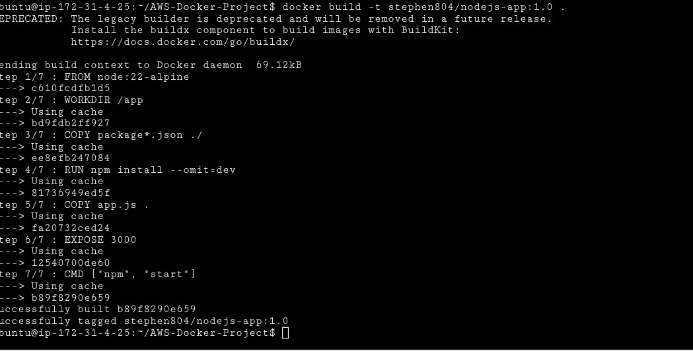
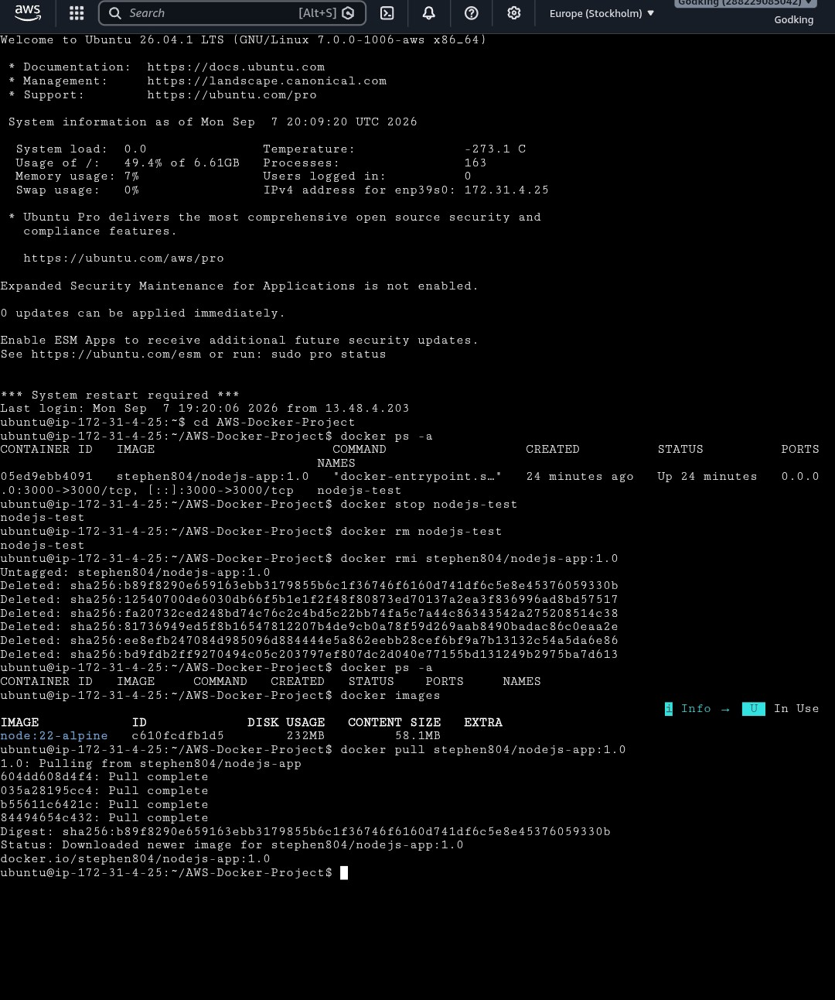
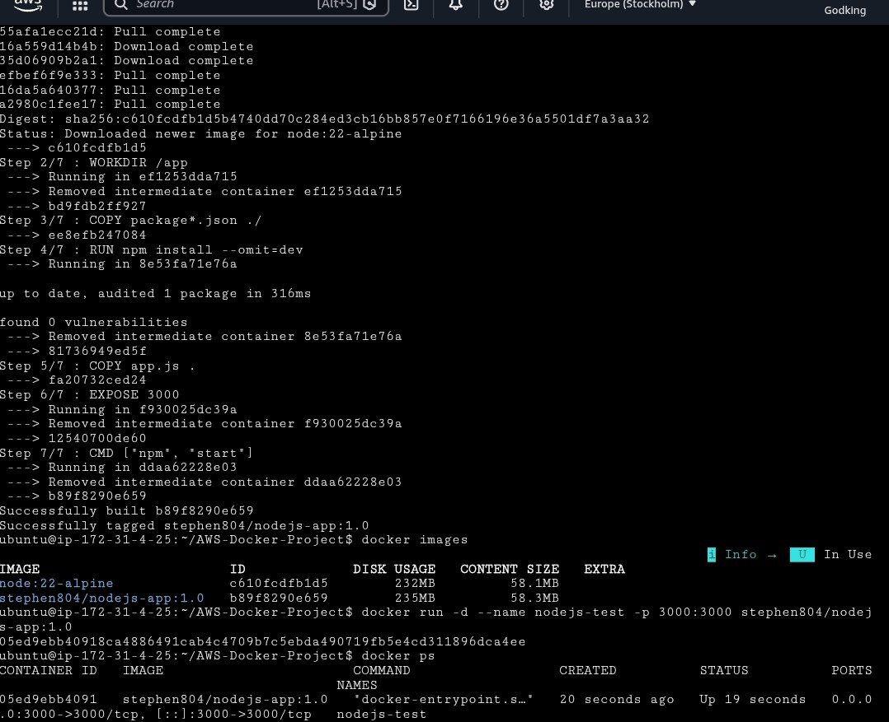
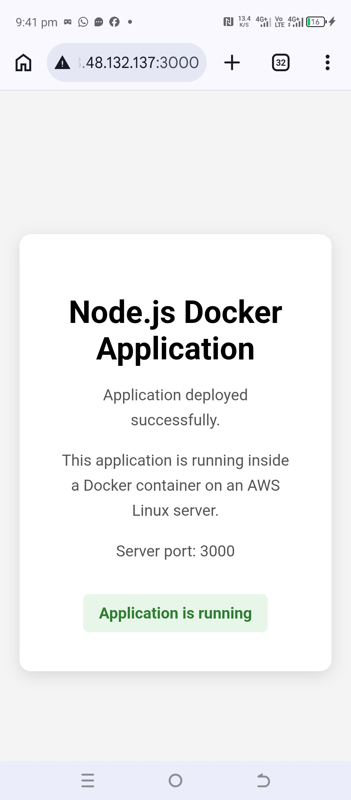

# AWS-Docker-Project
Node.js Docker Application

## Project Description

A simple Node.js application containerized with Docker and deployed on an AWS EC2 Ubuntu Linux server.

## Technologies Used

- Node.js
- Docker
- AWS EC2
- Ubuntu Linux
- Git
- GitHub
- Docker Hub

## Docker Image

stephen804/nodejs-app:1.0

## Docker Build

```bash
docker build -t stephen804/nodejs-app:1.0 .

##Docker Run
docker run -d --name nodejs-app-container -p 3000:3000 stephen804/nodejs-app:1.0

##Docker Hub
The Docker image is available on Docker Hub as:
stephen804/nodejs-app:1.0

##Deployment Evidence







